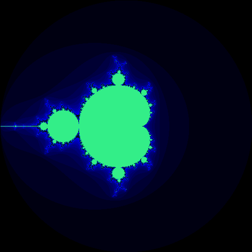

# Mandelbrot Fractal


Are you tired of using the same old boring graphics on your website? Do you want to spice things up and add some artistic flair to your digital creations? Well, have no fear, because I have a solution for you! Let me introduce you to the world of fractals in JavaScript.

Fractals are a fascinating mathematical concept that has captivated mathematicians and artists alike for decades. They are infinitely complex patterns that repeat themselves at different scales, creating beautiful, intricate designs. And with JavaScript, you can create your own fractals and use them to enhance your website's graphics.

To get started with fractals in JavaScript, you'll need to have a basic understanding of programming concepts such as loops and recursion. But don't worry if you're a beginner, because I'll guide you through each step.

The first thing you need to do is set up your canvas. In JavaScript, you can create a canvas element on your webpage and use it to draw your fractals. Here's an example of how you can set up your canvas:

`<canvas id="myCanvas" width="500" height="500"></canvas>`

In this example, we've created a canvas element with an id of "myCanvas" and set its dimensions to 500 pixels by 500 pixels.

Now, let's move on to the fun part: creating the fractals themselves. One of the most famous fractals is the Mandelbrot set. It's a set of complex numbers that, when iterated through a specific formula, either remain bounded or diverge to infinity. The resulting set of points can be plotted on a complex plane to create the iconic Mandelbrot fractal.

To create the Mandelbrot set in JavaScript, we'll need to use a bit of math and a bit of programming. Let's break the code down to get started. First, we retrieve the canvas element and its context, as well as the canvas's dimensions. We also set a maximum number of iterations and define the boundaries of our complex plane.


```
let canvas = document.getElementById("myCanvas");
let ctx = canvas.getContext("2d");
let width = canvas.width;
let height = canvas.height;
let max_iterations = 1000;
let xmin = -2;
let xmax = 2;
let ymin = -2;
let ymax = 2;
```

Next, we define a function called "mandelbrot" that takes in a real and imaginary number and iterates through the Mandelbrot formula to determine if that point is part of the set or not. The function returns the number of iterations it took to determine whether the point is in the set or not.

```
function mandelbrot(z_real, z_imag) {
  let zr = z_real;
  let zi = z_imag;
  let n = 0;
  while (n < max_iterations && zr * zr + zi *
zi < 4) {
    let new_zr = zr * zr - zi * zi + z_real;
    let new_zi = 2 * zr * zi + z_imag;
    zr = new_zr;
    zi = new_zi;
    n++;
  }
  return n;
}
```

After that, we use nested loops to iterate through each pixel in the canvas. For each pixel, we calculate the corresponding real and imaginary values on the complex plane using the pixel's coordinates and the boundaries we defined earlier. We then call the mandelbrot function with those values and get the number of iterations it took to determine if the point is in the set or not.

```
for (let x = 0; x < width; x++) {
  for (let y = 0; y < height; y++) {
    let x_real = xmin + (xmax - xmin) * x / width;
    let y_imag = ymin + (ymax - ymin) * y / height;
    let iterations = mandelbrot(x_real, y_imag);
```

Finally, we convert the number of iterations to a hexadecimal value and use that as the pixel's colour. We then fill the pixel with that colour.

```
    let color = iterations.toString(16);
    while (color.length < 3) {
      color = "0" + color;
    }
    ctx.fillStyle = "#" + color;
    ctx.fillRect(x, y, 1, 1);
  }
}
```

When you run this code, you'll see the iconic Mandelbrot set being drawn on your canvas! And the best part is that you can modify the boundaries and the maximum number of iterations to create different variations of the set.



But the Mandelbrot set is just one example of what you can create with fractals in JavaScript. There are countless other fractals that you can experiment with, such as the Julia set, the Sierpinski triangle, and the Koch snowflake.

One thing to keep in mind when working with fractals in JavaScript is that they can be computationally expensive. The Mandelbrot set, for example, requires a lot of iterations to create a high-resolution image. So, if you're working with larger canvases or more complex fractals, you may want to consider using a web worker or other techniques to optimize your code and improve performance.

In conclusion, fractals in JavaScript are a great way to add some artistic flair to your website's graphics. With just a bit of math and programming, you can create intricate and beautiful designs that will captivate your users. So why not give it a try and see what kind of fractal art you can create? Who knows, you might just discover your inner artist!
